# enhanced-FaaS-in-China

Improve the access speed and stability in China of web pages hosted on cloudflare, vercel or netlify by merely changing your CNAME record from the official one to one I made<br>
提升部署在 cloudflare、vercel 或 netlify 的网页在中国的访问速度和稳定性


[](https://hits.seeyoufarm.com)

## Usage

> [!NOTE]
>
> 我这里所说的把 cname 记录改为 xxx，意思是在你的权威 dns 服务器那把**用户**要访问的域名——例如 app.domain.com ——的 cname 记录改为对应平台的优选 cname 记录。
>
> _例子 1：_ 我部署在 vercel 的`blog.domain.com`博客需要加速访问速度，首先要把`blog.domain.com`的 cname 记录改为官方提供的域名，回到 vercel 的控制台查看 ssl 证书是否生成。生成之后再把 cname 记录改为`vercel-cname.xingpingcn.top`
>
> _例子 2：_ 我需要加速搭建在我的 vps 的网站，我需要使用 cf 作为 cdn 并保护源 ip 。[如何使用 saas 功能](docs/how2use-SaaS-for-CF/how2use-SaaS-for-CF.md)

- 如果你的网站部署在`vercel`，则把 cname 记录改为：
  - `vercel-cname.xingpingcn.top`
- 如果你的网站部署在`netlify`，则把 cname 记录改为：
  - `netlify-cname.xingpingcn.top`
- 如果你的网站部署在`netlify`和`vercel`上，则把 cname 记录改为：
  - `verlify-cname.xingpingcn.top`

> [!IMPORTANT]
>
> _使用此 dns 解析建议_：先把 cname 记录改为官方提供的 cname，等`ssl/tls证书`生成之后再把 cname 记录改为`verlify-cname.xingpingcn.top`

- 如果你的网站部署在`cf`上，则把 cname 记录改为：
  - `cf-cname.xingpingcn.top`

> [!IMPORTANT]
>
> _使用此 dns 解析建议_：
>
> 1. 如果你的域名托管在 cloudflare，那么使用这个 cname 很有可能会遇到 403。建议把你的域名托管在非 cloudflare 平台，然后再在 cf 平台中删除你的站点，之后再使用。
> 1. 如果有些服务，例如 cf worker、开启橙色云朵保护 vps 的 IP，必须要把域名托管在 cf，那么建议你使用 cf 的 saas 功能。[如何使用 saas 功能](docs/how2use-SaaS-for-CF/how2use-SaaS-for-CF.md)

### 怎么测速

> [!WARNING]
>
> 1. 无论是哪种方法测试，一定要加协议，然后多个测速网站都测一下，因为测速网站本身也会时不时抽风
> 1. 不要测我的这几个域名，因为会存在假阴性，太多人测会被对应平台认为是 ddos，虽然对 dns 解析没有影响。

1. 可以把 cname 记录改后测试
1. 也可以像下图一样填写相关信息然后测速
   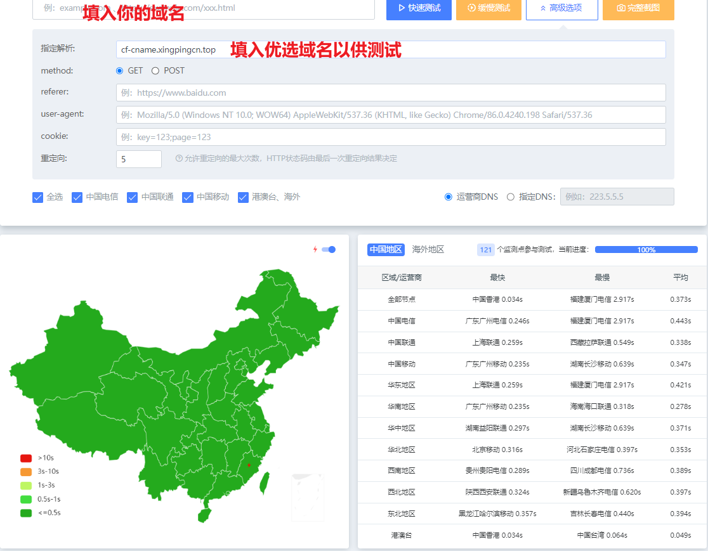

### 可能存在的问题

1. ~~浙江、福建、河南的个别 isp 访问可能会失败~~ 目前似乎只有泉州被墙（官方的 cname 也是同样的问题，或许是 isp 限制导致的。和你的域名有极大关系）
1. 对于测速工具的选择，itdog.cn 测出来的结果有点问题（会出现大片的红，原因未知），可以试试用 boce.com、cesu.net、阿里云拨测之内的来测

## Why to use it

1. 如果在大陆访问，官方的 anycast 会将流量大概率路由到东南亚，路线压力很大，但是存在压力较小的美国或者欧洲的路线。
1. 官方的 cname 有时在平均速度上是很快的，但是缺乏稳定性，会出现好几个省份都访问不了的情况，又或者个别省份响应时间非常长
1. 由于存在被墙风险，如果使用单一的平台——例如 vercel——则会存在全军覆没的情况，既国内所有地方都不能访问你的网站。

> [!NOTE]
>
> **这是优化后的速度**
>
> _注：目前似乎只有泉州被墙（红）；测速结果未能及时更新，现在显示的是之前的测速结果；测速速度没太大变化_
>
> 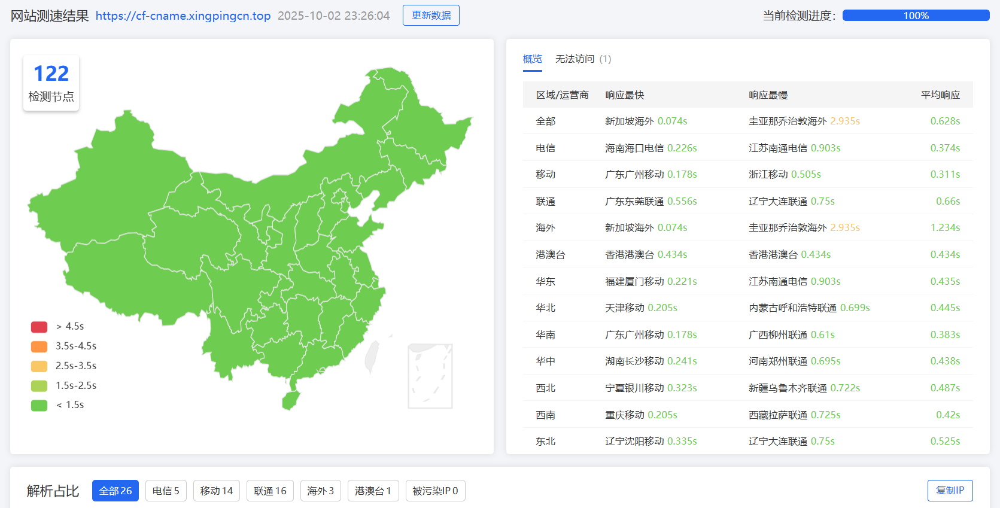
> cf-23 点晚高峰
> 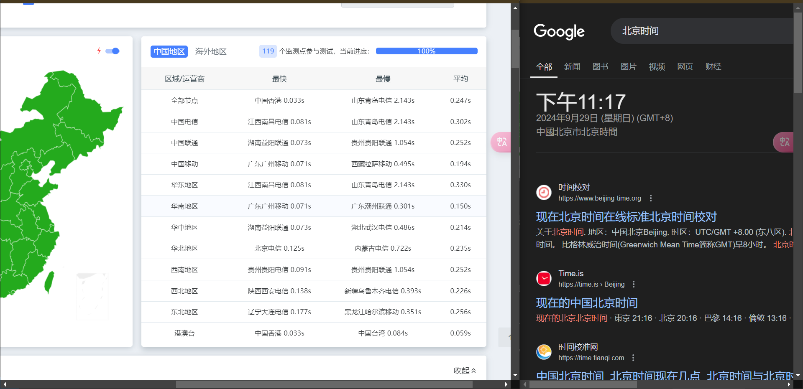
> vercel-23 点晚高峰


## 测速对比

> [!IMPORTANT]  
> _注：目前似乎只有泉州被墙（红）；测速结果未能及时更新，现在显示的是之前的测速结果；测速速度没太大变化_

<details>
<summary>点击查看结果</summary>


cf-23 点晚高峰
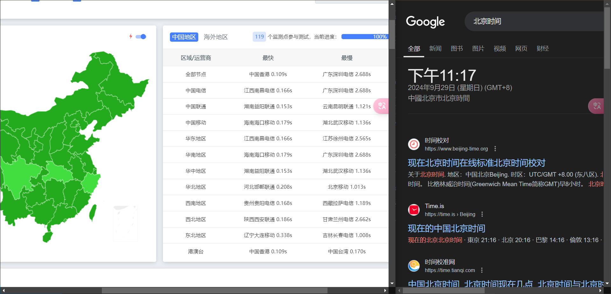
cf-23 点晚高峰
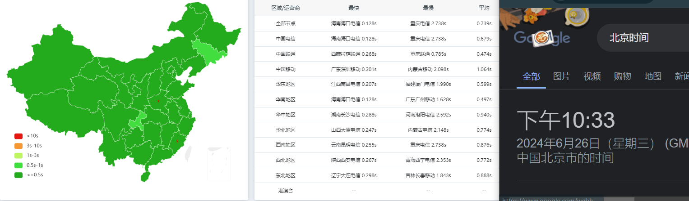
cf-22 点晚高峰
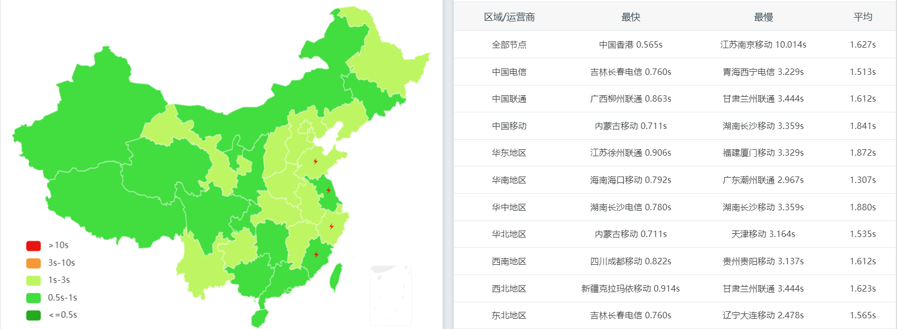
cf-23 点晚高峰-官方
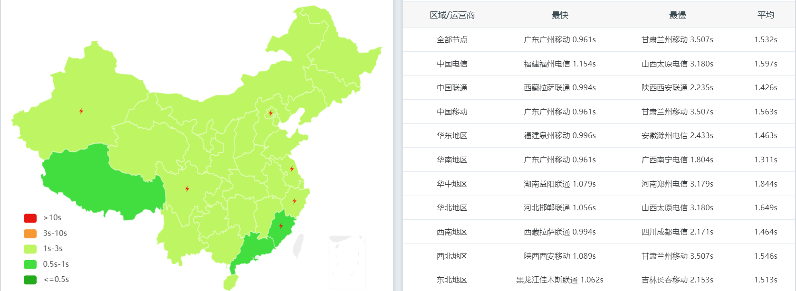
cf-22 点晚高峰-官方

vercel-23 点晚高峰
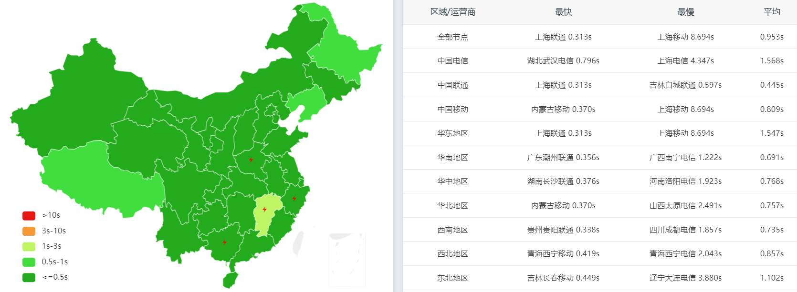
vercel-23 点晚高峰-官方
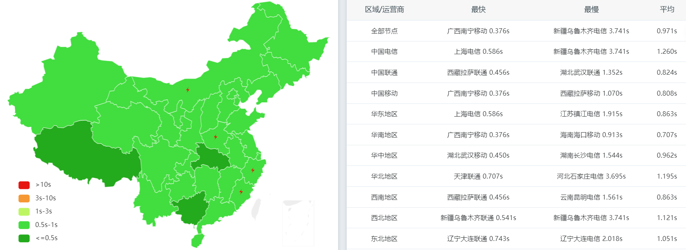
netlify-23 点晚高峰
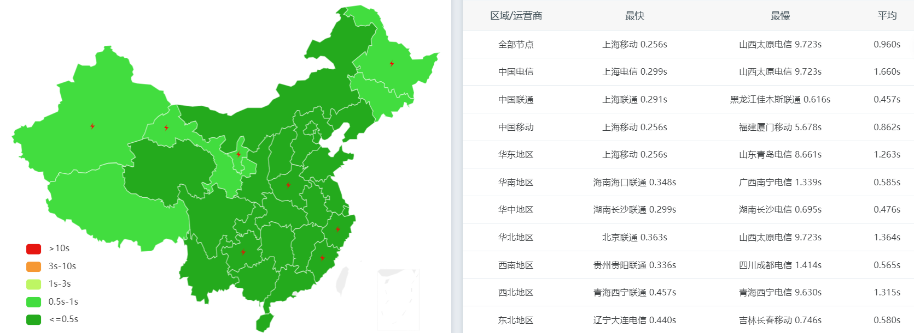
netlify-23 点晚高峰-官方
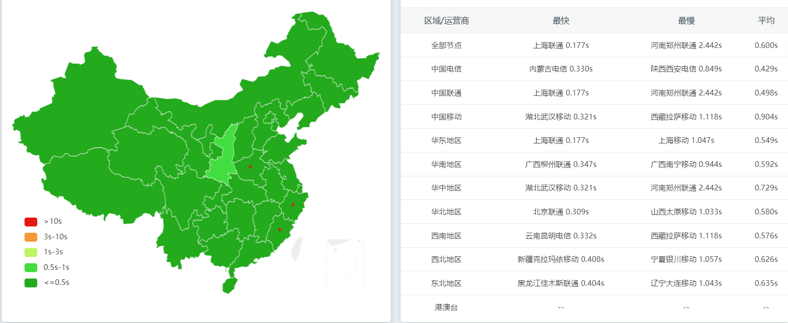
vercel 中午
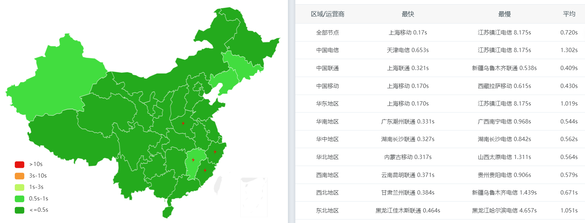
vercel 中午-官方
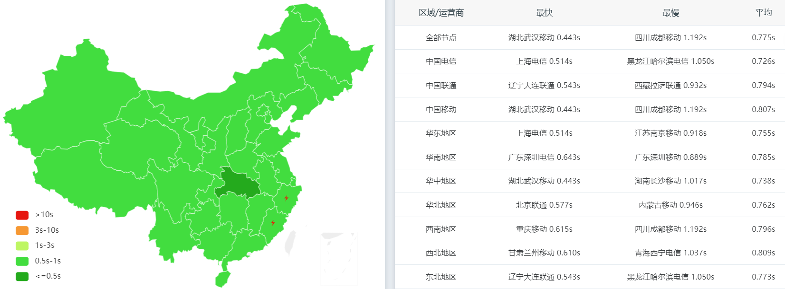
netlify 中午

netlify 中午-官方

</details>

## How it works

选取 cf、vercel 和 netlify 的 IP，定时测试速度，选取稳定且快的 ip 添加到域名的 A 记录。国内有三网优化，国外统一使用官方提供的 A 记录。

大概每 40 分钟更新一次。

### IP 来源

<details>
<summary>点击查看</b></summary><br>

- vercel
  - [vercel ip](https://gist.github.com/ChenYFan/fc2bd4ec1795766f2613b52ba123c0f8)
  - 官方`cname.vercel-dns.com.`的 A 记录
- netlify
  - 官方所提供的链接的 A 记录
- cf

  - 各种 cloudflare 的付费用户优选 ip

- 境外默认 ip

```json
{
  "VERCEL": "76.76.21.21",
  "NETLIFY": "75.2.60.5",
  "CF": "japan.com."
}
```

</details>

## Q&A

**Q：为什么设置了你的 CNAME 解析后访问速度没有达到 [测速对比](#测速对比) 中的效果？**<br>
A：

- 测速平台问题：多对比多个测速平台的结果，看看各个测速平台的结果是否一致
- 域名问题：你所测试的域名如果是免费的二级域名（eu.org、us.kg），或者是.xyz、.top 之类便宜的域名，也许会由于运营商的白名单机制而被墙，这种情况只能通过换域名解决（或者相信玄学等待你的域名被移入白名单）。
- 回源问题：测试对比显示的是部署在边缘服务器的静态网页的测速效果。测试使用的是 cf page 和 vercel、netlify 上部署的静态网页。
- DNS 解析问题：

1. 如果你使用 cf 的 dns 服务，本身在大陆里 dns 的解析速度就慢，而且还要增加多一次因为 cname 导致的 dns 递归解析，那就更慢了。如果可以那把域名托管在国内的权威 dns 服务器吧。
1. 如果你域名托管在 cf 或者 NS1.COM 这种不支持给顶级域名添加 cname 记录的 dns 服务器，请看 [这里#9](https://github.com/xingpingcn/enhanced-FaaS-in-China/issues/9#issuecomment-2379335329)
1. 或者你可以打开本 repo 根目录里面的三个 json 文件，里面是实时更新的 ip，如果你愿意，可以自己尝试着同步到你的 a 记录。repo 里的 ip 一般来说每 40 分钟更新一次。
1. **最后可能出现大问题的是我使用的华为云 dns，本来是国内的用户访问网站，却被华为云 dns 识别为国外用户，然后解析了默认的路线——例如 japan.com。** 

**Q：为什么设置了你的 CNAME 解析后网站不能访问？**<br>
A：

- 这大概率是使用了`verlify-cname.xingpingcn.top`导致的。需要先把 CNAME 记录改为官方提供的链接，等待 SSL 证书生成后再重新设置。这是由于该解析包含两个平台的 IP，平台每次访问都会获得二者之一的 IP，因而认为你在平台所填写的域名并不是你所拥有的。但是一旦生成证书后，证书就会缓存在平台上。
- netlify[支持上传自己的证书](/netlify_cert/readme.md)。如果还是不行就申请一个能自动续期的证书。

- 如果你的网站部署在`cf`上，使用`cf-cname.xingpingcn.top`，如果你的域名托管在 cloudflare，那么在这种情况下使用这个 cname 很有可能会遇到 403。建议把你的域名托管在非 cloudflare 平台，例如华为云，**然后在 cf 平台中删除你的站点**，之后再使用。
- 如果你只是在测速平台上遇到问题，你可能需要查看[怎么测速](#怎么测速)

<details>
<summary><b>Q：和官方提供的cname有什么差别？</b></summary>
<br>
A：

- 官方的 cname 有时在平均速度上是很快的，但是缺乏稳定性，会出现好几个省份都访问不了的情况，又或者个别省份相应时间非常长
- 而我的 cname 在平均速度上可能不是最快的，但平均响应速度尽量维持在 1 秒内，最长的响应时间控制在 2 秒内，而返回非 200 状态码的省份尽量少于等于 2 个
</details>
<details>
<summary><b>Q：为什么分路线解析不准确？</b></summary><br>

A：我使用的是权威 DNS 服务器自带的路线解析，可能存在误判。如果你想要更加精准的分路线解析，可以自行选取其他 DNS 服务器——如 dnspod——并添加[Netlify.json](https://raw.githubusercontent.com/xingpingcn/enhanced-FaaS-in-China/main/Netlify.json)或[Vercel.json](https://raw.githubusercontent.com/xingpingcn/enhanced-FaaS-in-China/main/Vercel.json)里的 IP 到 A 记录。或使用`NS1.COM`作为权威 DNS 服务器，并设置根据`ASN`进行路线解析。你可以看看我写的[ASN 列表](https://github.com/xingpingcn/china-mainland-asn)。

</details>

<details>
<summary><b>Q：为什么有的路线（如电信）的DNS A记录解析是官方提供的默认IP？</b></summary><br>

A：这是因为该路线的其他 IP 质量较差，所以暂时停止解析其路线，改用官方提供的默认 IP。你可以通过同时将网站部署在`vercel`和`netlify`，把 cname 解析改为`verlify-cname.xingpingcn.top`，从而提高容错率。两个平台同一线路同时失效的概率要低许多。

</details>
<details>
<summary><b>Q：为什么在json文件种有的路线是一个空列表？</b></summary><br>

A: 同上

</details>

## Custom

如果你想自定义，例如增加第三个平台，如`render`、`railway`等，则需要自己准备测速工具和一个域名，并重写`crawler.py`，在`platforms_to_test`新建一个`.py`文件，仿照文件夹内的其他文件重写`run_sub()`方法，最后修改`config.py`文件相关配置。

## Star History

[](https://starchart.cc/xingpingcn/enhanced-FaaS-in-China)

