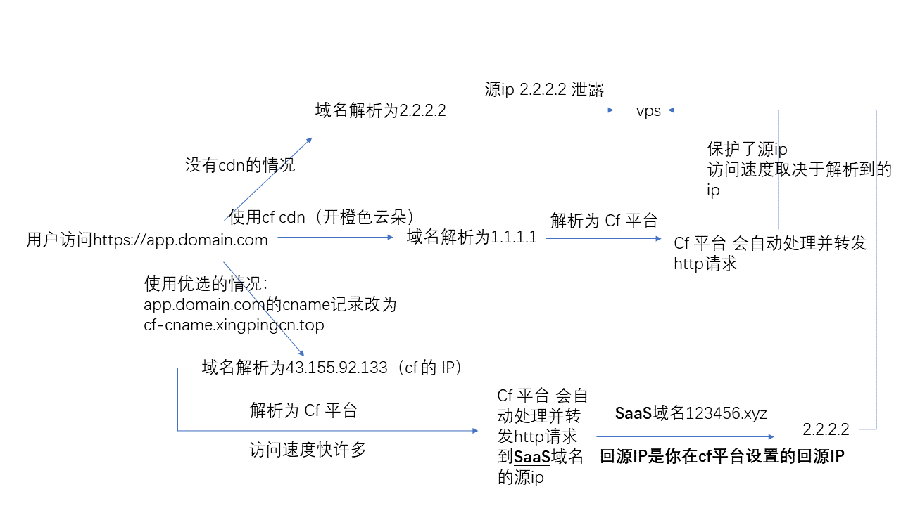
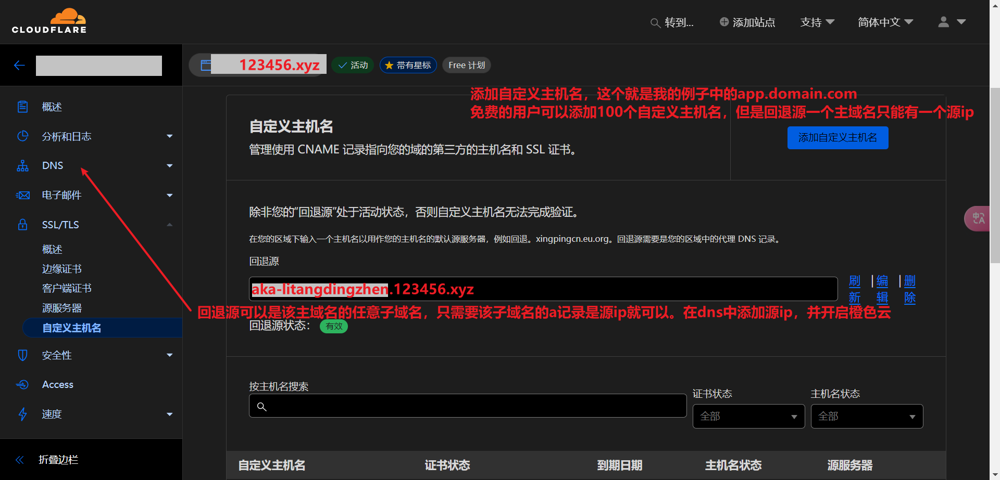
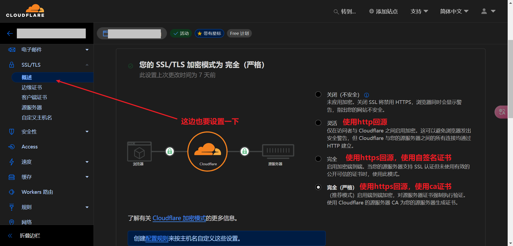

## 如何使用 cloudflare 的 saas 功能

### 需要什么

1. 外币信用卡或paypal。二者都需要扣 1 刀作为验证。如果是paypal很可能扣完 1 刀之后就不还了，信用卡是必还的。
1. 两个域名，一个用户访问你的app的域名，另一个域名作为saas回源用。

   * 这里有一个只需要一个域名的思路，理论上可行。我没有实践过。
   * 顶级域名 domain.com 托管在 cf，用户需要访问的域名为 app.domain.com，在 cf 中设置 app.domain.com 的 NS 记录其他为其他的权威 dns 服务器——例如 ns1.he.net （he.net的 dns 托管服务），又或者是大家熟悉的 dnspod 的 nameserver。总之要达到的目的就是让 app.domain.com 能在 cf 平台之外设置其cname记录。

### 为什么要使用 cf 的 saas 功能

因为要想使用优选域名`cf-cname.xingpingcn.top`，需要把你的 cname 改为非 cf 提供的 cname，cf 官方并没有直接提供相对应的方法。

可能需要 saas 的场景，包括但不限于：

1. 使用 cf 作为 cdn 并保护源 ip 
1. 使用 cf worker 的同时想使用优选域名
1. 使用 cf 的 Zero Trust

### 如何使用 cf 的 saas 功能

我以使用 cf 作为 cdn 并保护源 ip 作为例子。

saas 域名托管在 cf 平台。进入控制台。你需要先绑定银行卡

之后进入到 app.domain.com 的dns服务器，cname记录改为 `cf-cname.xingpingcn.top`

最后修改

## 注意事项

1. app.domain.com 不能托管在 cf ！否则会 403，原因未知。
1. 在[需要什么](#需要什么)中，我提到只需要一个域名的思路，你可以尝试把 domain.com 托管在cf，app.domain.com 托管在其他权威 dns 服务器。
